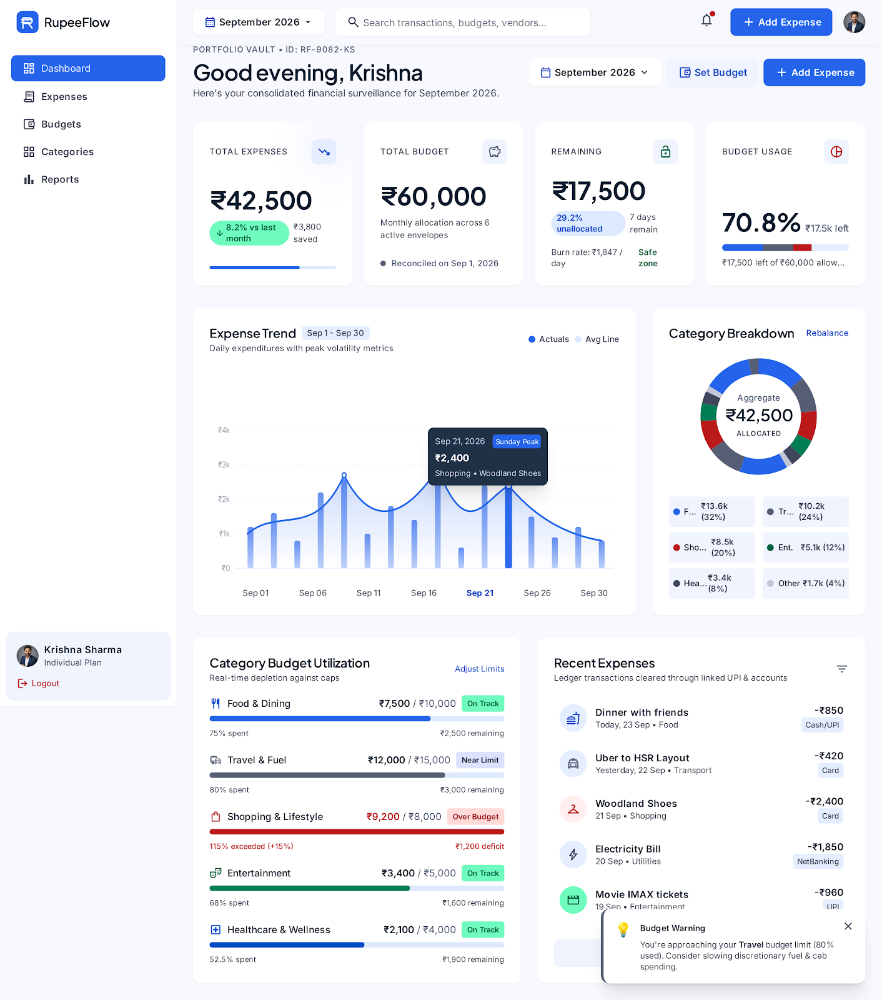
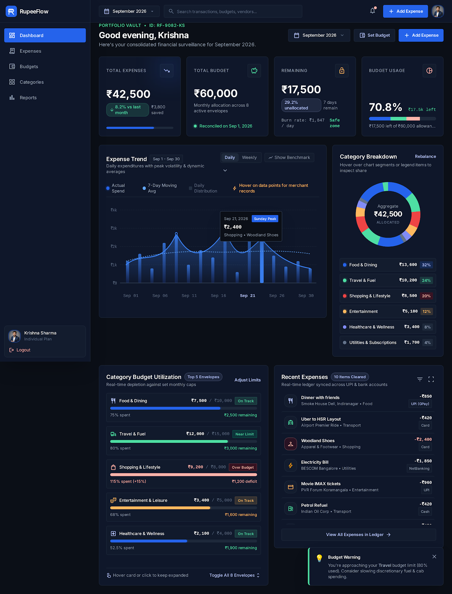
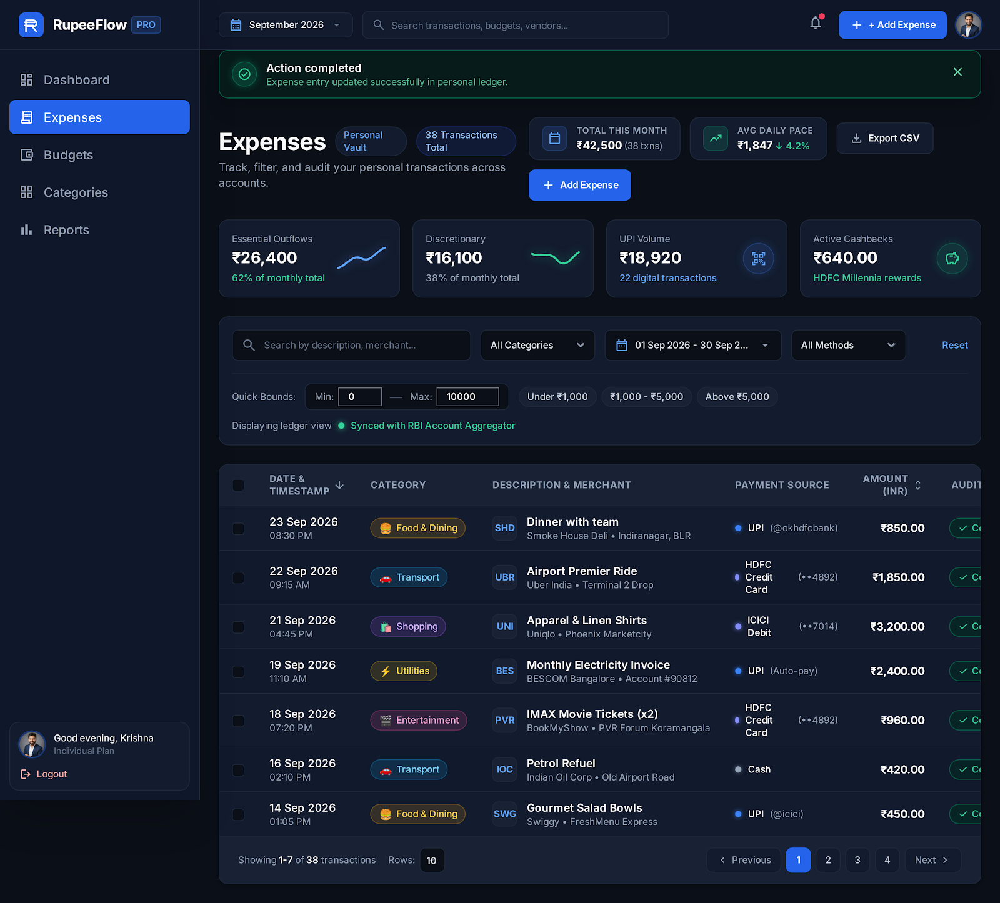
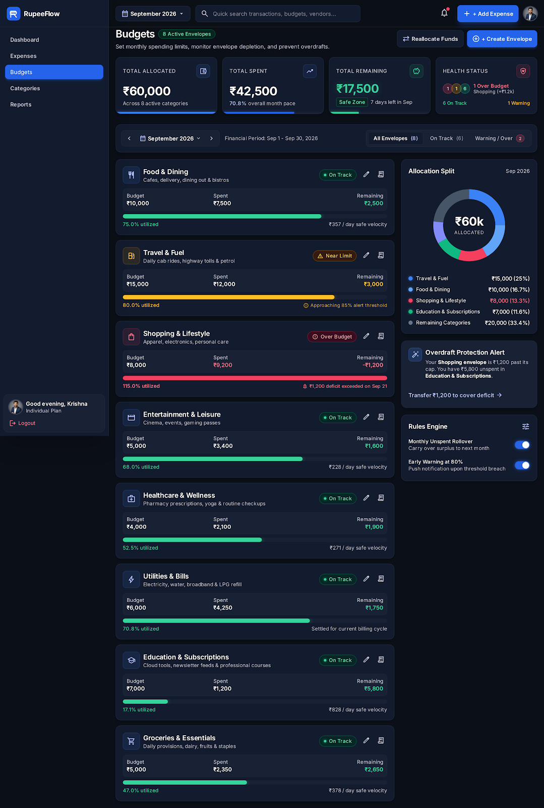
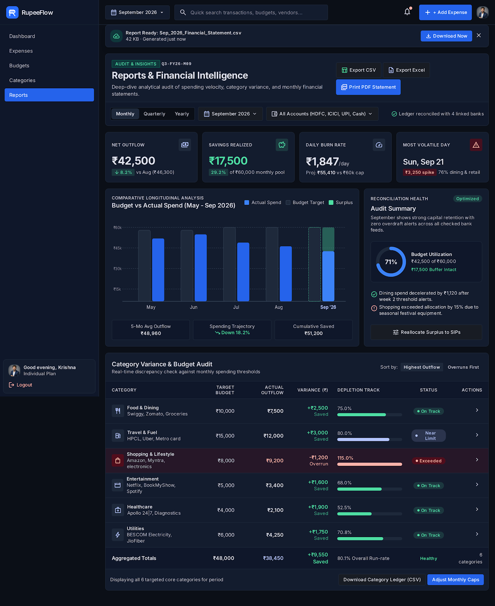
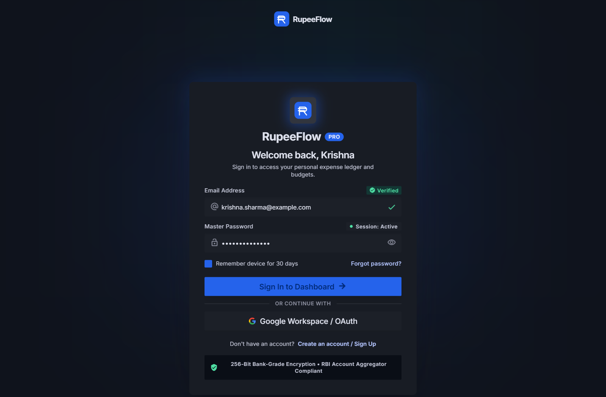
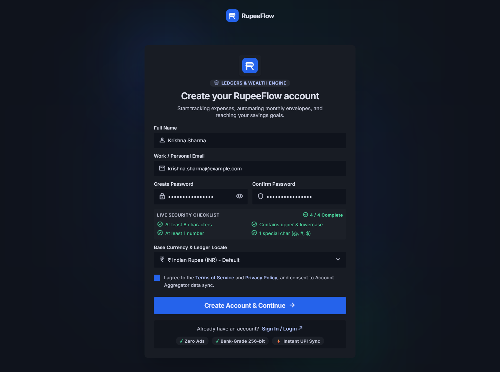
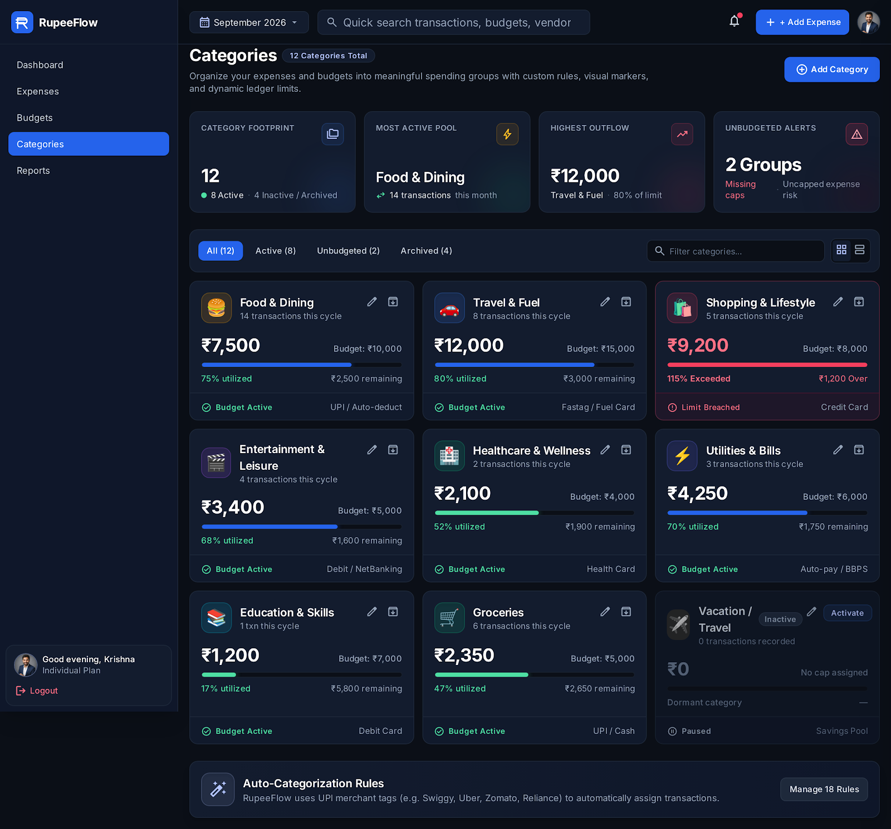
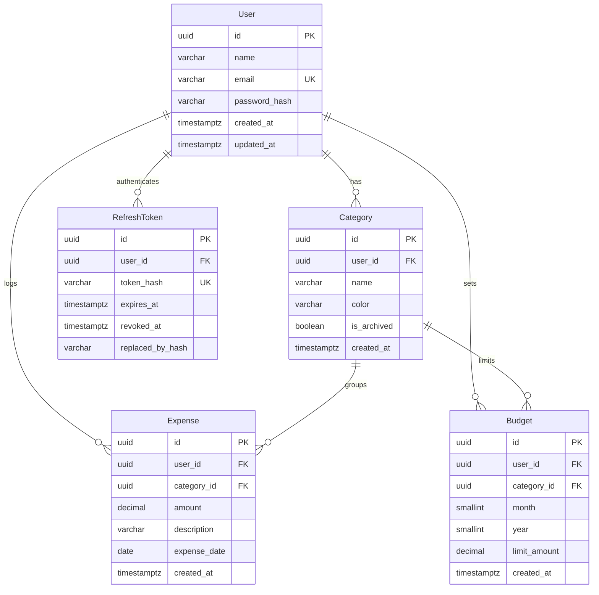

<p align="center">
  
</p>

<h1 align="center">RupeeFlow</h1>

<p align="center">
  <strong>Expense Tracker & Budget Management System</strong><br/>
  Track every rupee · Set monthly budgets · Export financial reports
</p>

<p align="center">
  
  
  
  
  
  
  
  
</p>

---

## 📸 Screenshots

### Dashboard — Financial Overview at a Glance

<p align="center">
  
</p>

<details>
<summary>🌙 Dark Mode</summary>
<p align="center">
  
</p>
</details>

### Expenses — Transaction Ledger

<p align="center">
  
</p>

### Budgets — Envelope Management

<p align="center">
  
</p>

### Reports — Financial Intelligence & Audit

<p align="center">
  
</p>

<details>
<summary>🔐 Authentication Screens</summary>

#### Login
<p align="center">
  
</p>

#### Sign Up
<p align="center">
  
</p>

</details>

<details>
<summary>🏷️ Categories Page</summary>
<p align="center">
  
</p>
</details>

---

## ✨ Features

| Module | Highlights |
|---|---|
| **Dashboard** | Monthly KPI cards (total expenses, budget, remaining, usage %), daily expense trend chart with moving average, category breakdown donut chart, budget utilization bars, recent transactions feed |
| **Expenses** | Full CRUD with sortable/paginated table, filter by category · date range · amount bounds, search by description, CSV export |
| **Budgets** | Envelope-style monthly budget per category, real-time spend vs. limit tracking, "On Track / Near Limit / Over Budget" status badges, allocation donut chart |
| **Categories** | User-defined expense groups with color codes, archive/restore, default categories created on sign-up |
| **Reports** | Monthly/quarterly/yearly views, budget vs. actual bar chart (longitudinal), category variance audit table, CSV & Excel export |
| **Auth** | JWT access + refresh token rotation, bcrypt password hashing, HTTP-only secure cookies, rate-limited auth routes |
| **Theming** | Light & dark mode with system preference detection, zero-flash on load |

---

## 🏗️ Architecture

```
rupeeflow/
├── backend/                 # Express REST API
│   ├── src/
│   │   ├── config/          # Environment, database client
│   │   ├── middleware/       # Auth, validation, rate-limit, error handling, logging
│   │   ├── modules/         # Feature modules (auth, expenses, budgets, categories, dashboard, reports)
│   │   │   └── <module>/
│   │   │       ├── *.routes.ts
│   │   │       ├── *.controller.ts
│   │   │       ├── *.service.ts
│   │   │       ├── *.repository.ts
│   │   │       └── *.schema.ts      # Zod validation
│   │   └── utils/
│   ├── prisma/
│   │   ├── schema.prisma    # Data model (User, Category, Expense, Budget, RefreshToken)
│   │   ├── migrations/
│   │   └── seed.ts          # Demo data (6 months of realistic transactions)
│   ├── tests/               # Jest integration tests
│   └── Dockerfile           # Multi-stage production image
│
├── frontend/                # React SPA
│   ├── src/
│   │   ├── api/             # Axios client with interceptors
│   │   ├── components/      # Reusable UI (charts, layout, ui primitives)
│   │   ├── context/         # Auth, Theme, Toast, Period providers
│   │   ├── features/        # Feature hooks & query keys (react-query)
│   │   ├── pages/           # Route-level page components
│   │   └── lib/             # Query client config
│   ├── e2e/                 # Playwright E2E tests
│   ├── tailwind.config.js
│   ├── vercel.json          # Vercel deployment (API proxy rewrite)
│   └── netlify.toml         # Netlify alternative deployment
│
├── .github/workflows/ci.yml # CI: typecheck → lint → test → build → E2E
├── docker-compose.yml       # PostgreSQL 16 (dev)
├── render.yaml              # Render Blueprint (API + managed Postgres)
└── package.json             # Monorepo root convenience scripts
```

---

## 🛠️ Tech Stack

### Backend
| Layer | Technology |
|---|---|
| Runtime | **Node.js ≥ 20** |
| Framework | **Express 4** |
| Language | **TypeScript 5.6** |
| ORM | **Prisma 6** with PostgreSQL 16 |
| Validation | **Zod** (request schemas) |
| Auth | **JWT** (access + refresh) · **bcrypt** · HTTP-only cookies |
| Security | **Helmet** · **CORS** · **express-rate-limit** |
| Export | **fast-csv** · **ExcelJS** |
| Testing | **Jest** + **Supertest** |

### Frontend
| Layer | Technology |
|---|---|
| Framework | **React 18** with **Vite 6** |
| Language | **TypeScript 5.6** |
| Styling | **Tailwind CSS 3** |
| State / Data | **TanStack React Query 5** · **React Context** |
| Forms | **React Hook Form** + **Zod** resolvers |
| Routing | **React Router 6** |
| Charts | **Recharts 2** |
| Dates | **date-fns 4** |
| Testing | **Vitest** · **React Testing Library** · **MSW** (mocks) |
| E2E | **Playwright** |

### Infrastructure
| Concern | Technology |
|---|---|
| Database (Dev) | **Docker Compose** → PostgreSQL 16 Alpine |
| Backend Deploy | **Render** (Docker web service + managed Postgres) |
| Frontend Deploy | **Vercel** or **Netlify** (static + API proxy rewrite) |
| CI/CD | **GitHub Actions** (typecheck → lint → test → build → Playwright E2E) |

---

## 🚀 Quick Start

### Prerequisites

- **Node.js ≥ 20** and **npm**
- **Docker** & **Docker Compose** (for PostgreSQL)

### 1. Clone & Install

```bash
git clone https://github.com/<your-username>/rupeeflow.git
cd rupeeflow

# Install all dependencies (backend + frontend) and run Prisma migrations
npm run setup
```

### 2. Start the Database

```bash
npm run db:up          # Starts PostgreSQL 16 in Docker on port 5433
```

### 3. Configure Environment

```bash
# Backend
cp backend/.env.example backend/.env
# → Edit backend/.env and set a strong JWT_SECRET

# Frontend
cp frontend/.env.example frontend/.env
# → Defaults work out of the box for local dev
```

### 4. Seed Demo Data (Optional)

```bash
npm run seed
# Creates demo user: demo@rupeeflow.app / Demo@12345
# with 6 months of realistic expense & budget data
```

### 5. Run Development Servers

```bash
# Terminal 1 — API server (http://localhost:4000)
npm run dev:api

# Terminal 2 — Frontend dev server (http://localhost:5173)
npm run dev:web
```

Open **http://localhost:5173** and sign in with the demo credentials, or create your own account.

---

## 🗄️ Database Schema



---

## 🔌 API Endpoints

All endpoints are prefixed with `/api`. Protected routes require `Authorization: Bearer <token>`.

| Method | Endpoint | Description | Auth |
|---|---|---|---|
| `POST` | `/api/auth/register` | Create account (returns tokens) | ✗ |
| `POST` | `/api/auth/login` | Sign in (returns tokens) | ✗ |
| `POST` | `/api/auth/refresh` | Rotate refresh token | ✗ |
| `POST` | `/api/auth/logout` | Revoke refresh token | ✓ |
| `GET` | `/api/auth/me` | Current user profile | ✓ |
| `GET` | `/api/categories` | List user categories | ✓ |
| `POST` | `/api/categories` | Create category | ✓ |
| `PATCH` | `/api/categories/:id` | Update category | ✓ |
| `DELETE` | `/api/categories/:id` | Delete category | ✓ |
| `GET` | `/api/expenses` | List expenses (paginated, filterable) | ✓ |
| `POST` | `/api/expenses` | Create expense | ✓ |
| `PATCH` | `/api/expenses/:id` | Update expense | ✓ |
| `DELETE` | `/api/expenses/:id` | Delete expense | ✓ |
| `GET` | `/api/budgets` | List budgets for a period | ✓ |
| `POST` | `/api/budgets` | Create/update budget | ✓ |
| `DELETE` | `/api/budgets/:id` | Delete budget | ✓ |
| `GET` | `/api/dashboard` | Dashboard aggregations | ✓ |
| `GET` | `/api/reports` | Report data (monthly/quarterly/yearly) | ✓ |
| `GET` | `/api/reports/export` | Export CSV/Excel | ✓ |
| `GET` | `/health` | Health check | ✗ |

---

## 🧪 Testing

```bash
# Run all tests (backend + frontend)
npm test

# Backend only (Jest — integration tests against Postgres)
npm --prefix backend test
npm --prefix backend run test:coverage

# Frontend only (Vitest — unit + component tests with MSW mocks)
npm --prefix frontend test
npm --prefix frontend run test:coverage

# E2E (Playwright — full browser tests)
npm run test:e2e
```

---

## 🧹 Code Quality

```bash
# Type checking
npm run typecheck

# Linting (ESLint)
npm run lint

# Formatting (Prettier)
npm --prefix backend run format
npm --prefix frontend run format

# Build production bundles
npm run build
```

---

## 🐳 Docker

### Local Development (Database only)

```bash
npm run db:up         # Start PostgreSQL container
npm run db:down       # Stop and remove container
```

### Full Backend Container

```bash
cd backend
docker build -t rupeeflow-api .
docker run -p 4000:4000 --env-file .env rupeeflow-api
```

---

## ☁️ Deployment

### Backend → Render

The included [`render.yaml`](render.yaml) Blueprint deploys the API as a Docker web service with a managed PostgreSQL instance.

1. Connect your GitHub repo to [Render](https://render.com)
2. Render auto-detects the Blueprint and provisions the database
3. Set `FRONTEND_ORIGIN` to your deployed frontend URL

### Frontend → Vercel

The included [`frontend/vercel.json`](frontend/vercel.json) configures:
- API proxy rewrite (`/api/*` → Render backend) to keep cookies first-party
- SPA fallback for client-side routing
- Immutable asset caching

### Frontend → Netlify (Alternative)

The included [`frontend/netlify.toml`](frontend/netlify.toml) provides the same proxy + SPA rewrite setup.

---

## 📂 Monorepo Scripts

All convenience scripts live in the root [`package.json`](package.json):

| Command | Description |
|---|---|
| `npm run db:up` | Start PostgreSQL via Docker Compose |
| `npm run db:down` | Stop PostgreSQL |
| `npm run setup` | Install deps + generate Prisma + run migrations |
| `npm run seed` | Seed demo user with 6 months of data |
| `npm run dev:api` | Start backend dev server |
| `npm run dev:web` | Start frontend dev server |
| `npm test` | Run all tests |
| `npm run test:e2e` | Playwright end-to-end tests |
| `npm run typecheck` | TypeScript check (both packages) |
| `npm run lint` | ESLint (both packages) |
| `npm run build` | Production build (both packages) |

---

## 🔒 Security

- **Password hashing** — bcrypt with configurable cost factor (default 12)
- **JWT access tokens** — short-lived (15 min default), stored in memory
- **Refresh tokens** — hashed in DB, HTTP-only secure cookie, automatic rotation with revocation chain
- **CORS** — explicit origin whitelist, credentials mode
- **Helmet** — security headers (CSP, HSTS, X-Frame-Options, etc.)
- **Rate limiting** — auth routes protected against brute-force (10 attempts / 15 min)
- **Input validation** — Zod schemas on every endpoint
- **SQL injection** — Prisma parameterized queries
- **`trust proxy`** — enabled in production for correct client IP behind load balancers

---

## 📄 License

This project is provided as-is for educational and personal use. See the repository for any applicable license terms.

---

<p align="center">
  <br/>
  <sub>Built with ☕ and TypeScript</sub>
</p>
